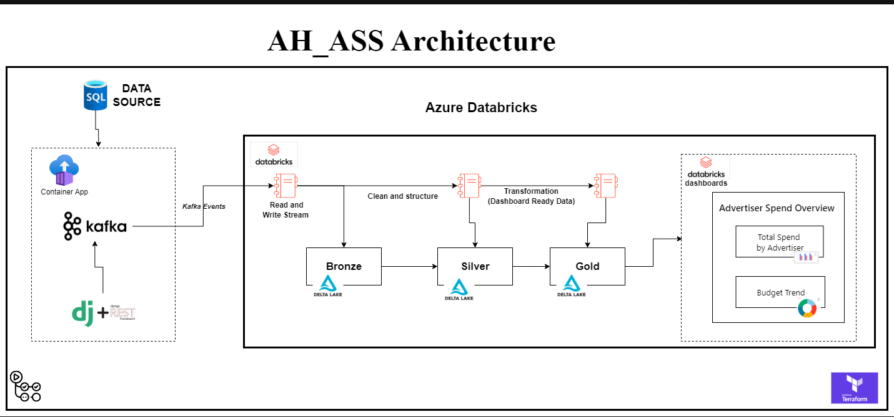
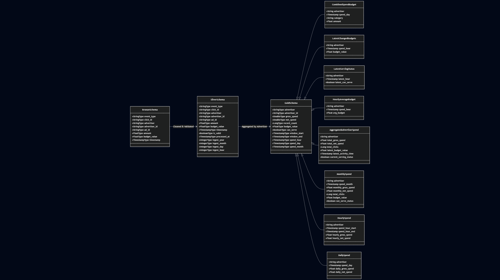
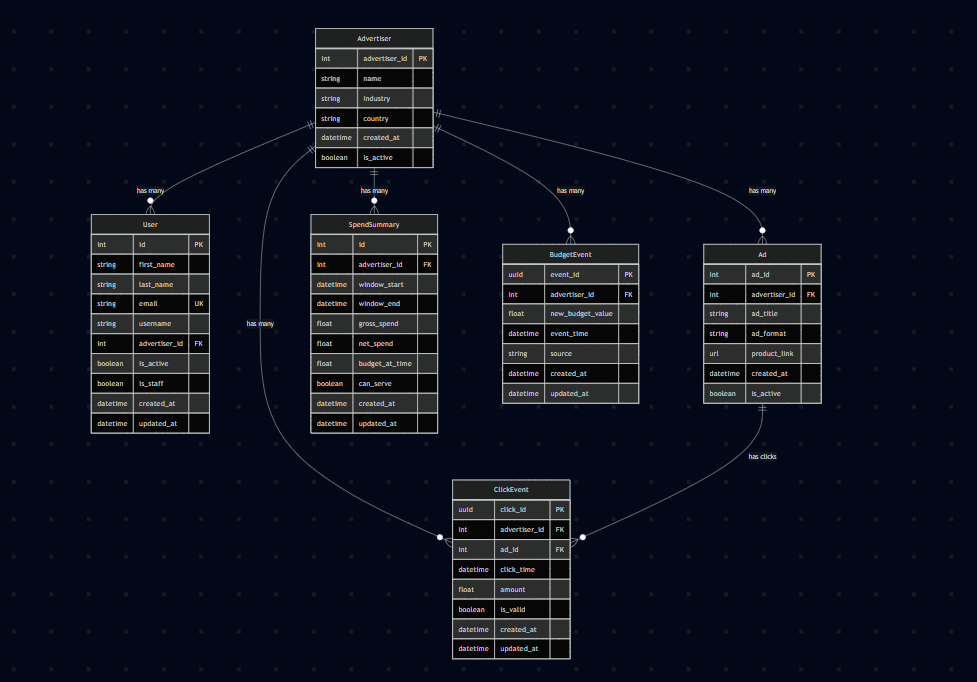
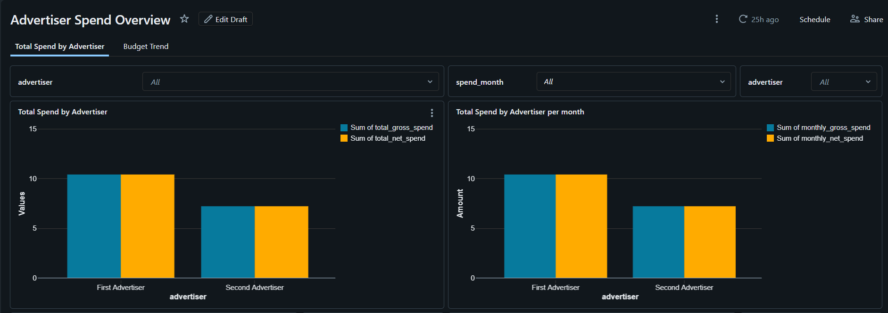
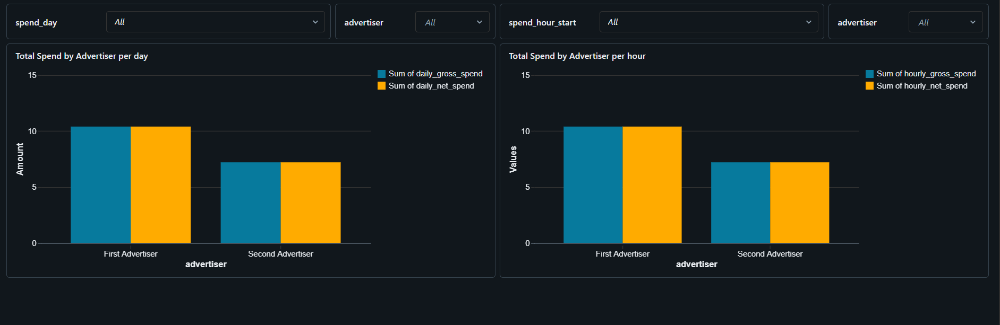
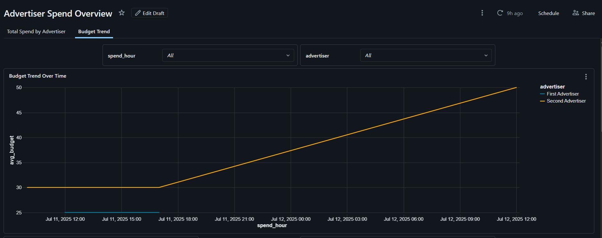
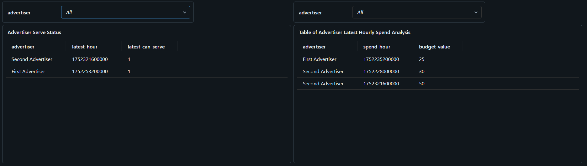
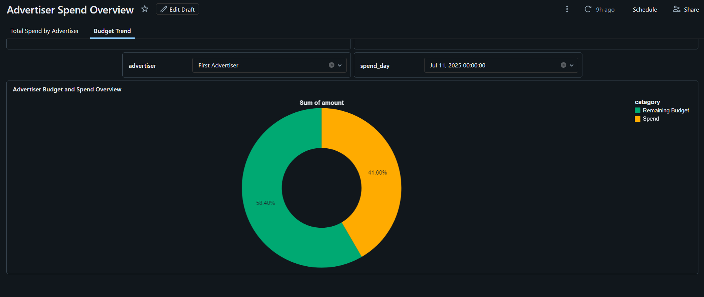

# Ad Marketing Pipeline

A real-time data pipeline for ad marketing budget management using Apache Spark, Delta Lake, and Azure Event Hubs on Databricks.

# Architecture Overview

## Overview

This pipeline processes ad click events in real-time to track advertiser spending against budgets and make serving decisions. It follows the medallion architecture pattern with Bronze, Silver, and Gold layers.

## Documentation

For detailed API documentation, see:

- [Processors](api-reference/processors.md)
- [Streaming](api-reference/streaming.md)
- [Configuration](api-reference/config.md)

## Schema Diagram

## Backend Schema Diagram

## Dashboards

